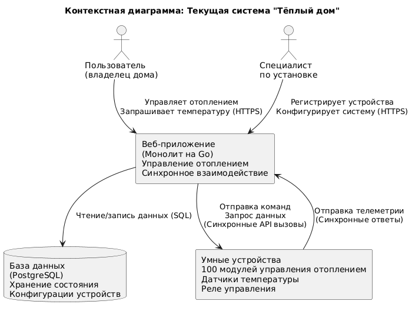

# Задание 1. Анализ и планирование

### 1. Описание функциональности монолитного приложения


**Управление отоплением:**

- Пользователи могут удалённо включать/выключать отопление в своих домах
- Система обеспечивает удалённое управление отоплением в доме

**Мониторинг температуры:**

- Пользователи могут просматривать текущую температуру в своих домах через веб-интерфейс
- Система получает данные о температуре с датчиков, установленных в домах

### 2. Анализ архитектуры монолитного приложения

- Язык программирования: Go
- База данных: PostgreSQL
- Архитектура: Монолитная, все компоненты системы (обработка запросов, бизнес-логика, работа с данными) находятся в рамках одного приложения.
- Взаимодействие: Синхронное, запросы обрабатываются последовательно.
- Масштабируемость: Ограничена, так как монолит сложно масштабировать по частям.
- Развертывание: Требует остановки всего приложения.

### 3. Определение доменов и границы контекстов

- Домен управления отоплением
 	- Поддомен изменения температуры 
   		- Изменение температуры пользователем 
   		- Автоматическая поддержка температуры 
- Домен мониторинга 
 	- Поддомен нотификации пользователей 
   		- Отправка смс пользователю 
   		- Отправка емейла пользователю 
 	- Поддомен отслеживания температуры (отчет) 
   		- Ведение журнала температуры 
- Домен подключения к умному дому 
 	- Поддомен управления устройствами
   		- Проверка работоспособности / доступности датчиков 
   		- Регистрация датчиков 
   		- Замена датчика 
   		- Удаление датчика 
   		- Настройка параметров датчика 
   		- Ведение реестра датчиков 
- Домен управления пользователями 
 	- Поддомен управления пользователями
   		- Регистрация пользователя
   		- Удаление 
   		- Изменение 
   		- Связь пользователя дома и домов 
   		- Ведение реестра пользователей 
 	- Поддомен управления администраторами 
   		- Выдача прав админа
   		- Аудит действий админа 

### **4. Проблемы монолитного решения**

**Ограниченная функциональность:**
Поддерживает только управление отоплением, не позволяет контролировать другие умные устройства (свет, розетки, безопасность и т.д.), требуемые новым заказом

**Проблемы масштабируемости:**
Монолитная синхронная архитектура неэффективна для обработки данных тысяч новых устройств и пользователей в экосистеме "умных поселков". Вертикальное масштабирование дорого и ограничено.

**Высокая стоимость внедрения:**
Обязательный выезд специалиста для подключения каждого дома создает "бутылочное горлышко", увеличивает стоимость и замедляет рост клиентской базы.

**Отсутствие самообслуживания:**
Пользователи не могут самостоятельно подключать/настраивать устройства, что критично для массового внедрения и удобства.

**Негибкость для разработки:**
Добавление нового функционала (управление другими устройствами) в монолит сложно, рискованно и замедляет выпуск обновлений.

**Низкая отказоустойчивость:**
Сбой в одной части монолита (например, при запросе температуры) может привести к падению всей системы.

**Неэффективное управление данными:**
Единая БД PostgreSQL для всех функций может стать узким местом производительности и не оптимальна для разных типов данных (температура, статус устройств, события).

**Сложность тестирования:**
Изменения требуют тестирования всего монолита, а не отдельных компонентов, что увеличивает время и риски QA.

**Блокирующие операции:**
Синхронные вызовы "сервер -> датчик" делают систему чувствительной к задержкам сети и простоям датчиков, ухудшая отзывчивость.

**Несоответствие новым требованиям:**
Архитектура не поддерживает реактивные сценарии (устройства сами сообщают о событиях) и сложную логику взаимодействия умного дома/поселка.

### 5. Визуализация контекста системы — диаграмма С4

**Контекстная диаграмма текущей монолитной системы "Тёплый дом":**



**Исходный код диаграммы:** [diagrams/context-diagram-simple.puml](diagrams/context-diagram-simple.puml)

# Задание 2. Проектирование микросервисной архитектуры

**Диаграмма контейнеров (Containers)**


**Диаграмма компонентов (Components)**


**Диаграмма кода (Code)**


# Задание 3. Разработка ER-диаграммы


# Задание 4. Создание и документирование API

### 1. Тип API

**REST API для:**
 - Управления ресурсами (устройства, пользователи, сценарии)
 - Операций, требующих немедленного ответа (статус устройства, аутентификация)
 - Где важна синхронная обработка (95% запросов)

**AsyncAPI (Kafka) для:**
 - Потоковой обработки телеметрии
 - Распространения событий изменения состояния
 - Асинхронного выполнения команд
 - Где важна масштабируемость

Комбинация синхронных и асинхронных интерфейсов обеспечит:
 - Низкую задержку для пользовательских действий
 - Горизонтальную масштабируемость для обработки событий
 - Отказоустойчивость через очереди сообщений
 - Эффективное разделение ответственности между сервисами

### 2. Документация API

[Документация Device Service: REST API (OpenAPI)](apps/smart_home/api/device-management-api.yaml)

**Пример вызова**

Регистрация нового устройства:

```
http
POST /devices
Content-Type: application/json

{
  "serialNumber": "SN-TH-001",
  "typeId": "f47ac10b-58cc-4372-a567-0e02b2c3d479",
  "houseId": "550e8400-e29b-41d4-a716-446655440000"
}
```

Ответ:

```
json
{
  "deviceId": "3fa85f64-5717-4562-b3fc-2c963f66afa6",
  "status": "ACTIVE",
  "firmwareVersion": "1.2.3"
}
```

# Задание 5. Работа с docker и docker-compose

Перейдите в apps.

Там находится приложение-монолит для работы с датчиками температуры. В README.md описано как запустить решение.

Вам нужно:

1) сделать простое приложение temperature-api на любом удобном для вас языке программирования, которое при запросе /temperature?location= будет отдавать рандомное значение температуры.

Locations - название комнаты, sensorId - идентификатор названия комнаты

```
	// If no location is provided, use a default based on sensor ID
	if location == "" {
		switch sensorID {
		case "1":
			location = "Living Room"
		case "2":
			location = "Bedroom"
		case "3":
			location = "Kitchen"
		default:
			location = "Unknown"
		}
	}

	// If no sensor ID is provided, generate one based on location
	if sensorID == "" {
		switch location {
		case "Living Room":
			sensorID = "1"
		case "Bedroom":
			sensorID = "2"
		case "Kitchen":
			sensorID = "3"
		default:
			sensorID = "0"
		}
	}
```

2) Приложение следует упаковать в Docker и добавить в docker-compose. Порт по умолчанию должен быть 8081

3) Кроме того для smart_home приложения требуется база данных - добавьте в docker-compose файл настройки для запуска postgres с указанием скрипта инициализации ./smart_home/init.sql

Для проверки можно использовать Postman коллекцию smarthome-api.postman_collection.json и вызвать:

- Create Sensor
- Get All Sensors

Должно при каждом вызове отображаться разное значение температуры

Ревьюер будет проверять точно так же.

**Ссылка на PlantUML диаграмму:**
```
https://plantuml.com/ru/plantuml/uml/SyfFKj2rKt3CoKnELR1Io4ZDoSa70000
```

## 3. Локальная генерация (если у вас установлен PlantUML)

Если у вас установлен PlantUML локально:


